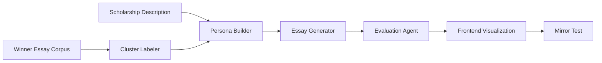

# DEVELOPMENT.md  
**Project:** Adaptive Scholarship Matching + AI Drafting  
**Maintainer:** Nguyen Duc Anh Vo (Bruce Vo)  
**Purpose:** This document provides full technical instructions for setting up, running, and contributing to the system — ensuring both human developers and Claude Code operate consistently across environments.

---

## ⚙️ 1. Overview

This repository is a **full-stack AI application** that helps students discover scholarships and automatically generate tailored essays using explainable AI reasoning.  
It consists of:

- **Frontend:** React + TypeScript + Zustand (UI and visualization)
- **Backend:** FastAPI + PostgreSQL (API and LLM orchestration)
- **LLM Integration:** Anthropic Claude API (defined under `.claude/`)
- **Data Layer:** Scholarship descriptions, student profiles, and winner essay clusters  

---

## 🧩 2. System Requirements

| Component | Version | Notes |
|-----------|---------|-------|
| Node.js | ≥ 18.x | Required for frontend (Vite) |
| npm | ≥ 9.x | Dependency management |
| Python | ≥ 3.11 | Backend core language |
| PostgreSQL | ≥ 14 | Database |
| Redis *(optional)* | ≥ 6 | For caching prompts or results |
| Anthropic Claude API Key | Active | Needed for LLM operations |

---

## 🧱 3. Repository Setup

Clone the repository and install both backend and frontend dependencies.

```bash
# Clone the repository
git clone https://github.com/<your-org>/adaptive-scholarship-ai.git
cd adaptive-scholarship-ai

# Create a local environment file
cp .env.example .env
```

**Note:** Update `CLAUDE_API_KEY` and `DATABASE_URL` inside `.env` before running.

---

## 🚀 4. Backend Setup (FastAPI)

### Install Python dependencies
```bash
cd backend
python -m venv venv
source venv/bin/activate  # or venv\Scripts\activate on Windows
pip install -r requirements.txt
```

### Database setup
```bash
# Start PostgreSQL locally (Docker example)
docker run --name scholarship-db -e POSTGRES_PASSWORD=password -p 5432:5432 -d postgres:14

# Run migrations
alembic upgrade head
```

### Run backend server
```bash
uvicorn main:app --reload
```

Backend will run at `http://localhost:8000`

### Useful commands

| Command | Purpose |
|---------|---------|
| `pytest` | Run backend tests |
| `alembic revision --autogenerate -m "desc"` | Create DB migration |
| `alembic upgrade head` | Apply DB schema |
| `alembic downgrade -1` | Rollback last migration |

---

## 💻 5. Frontend Setup (React + Vite)

### Install dependencies
```bash
cd frontend
npm ci
```

### Start development server
```bash
npm run dev
```

Frontend will run at `http://localhost:5173`

### Build for production
```bash
npm run build
```

### Lint & Type Check
```bash
npm run lint
npm run typecheck
```

### Run tests
```bash
npm run test
```

---

## 🤖 6. Claude Code Integration

### Location of configuration files
All AI prompt logic and workflow definitions are in the `.claude/` directory.

| Folder | Purpose |
|--------|---------|
| `.claude/system/` | Context, setup, task mapping, coding rules |
| `.claude/prompts/` | Modular prompt files (persona, essay, evaluation, etc.) |
| `.claude/utils/` | JSON schema definitions and test cases |
| `CLAUDE.md` | Main configuration file read by Claude Code |

### Claude Code reads these files automatically in Plan / Auto Mode to understand:
- Which tasks to run (`task_guide.md`)
- Expected input/output schemas (`schema_examples.md`)
- Validation examples (`testcases.md`)
- Project-wide conventions (`CLAUDE.md`)

### Local validation
You can verify LLM outputs using backend validator scripts:
```bash
python scripts/validate_prompts.py
```

### Updating or adding a new prompt
1. Create a new `.md` file inside `.claude/prompts/`.
2. Add schema to `.claude/utils/schema_examples.md`.
3. Add a sample testcase to `.claude/utils/testcases.md`.
4. Update `.claude/system/task_guide.md` to register the prompt.
5. Commit all changes.

---

## 🧠 7. Data Flow



### Component Descriptions:
- **Persona Builder** → Extracts weights and tone.
- **Essay Generator** → Drafts adaptive essay.
- **Evaluation Agent** → Compares adaptive vs baseline.
- **Mirror Test** → Provides improvement suggestions.
- **Cluster Labeler** → Learns personality patterns from winners.

---

## 🔍 8. Development Workflow

| Step | Task | Tools |
|------|------|-------|
| 1 | Implement backend endpoints | FastAPI, SQLAlchemy |
| 2 | Create UI components for essay visualization | React, Zustand, Recharts |
| 3 | Integrate Claude prompts | Claude API, `.claude/` setup |
| 4 | Validate schema outputs | pydantic, `schema_examples.md` |
| 5 | Add test cases | Jest (frontend) / pytest (backend) |
| 6 | Run local integration | `npm run dev` + `uvicorn main:app` |
| 7 | Push changes → Create PR | GitHub workflow |
| 8 | Review & merge | Ensure CI tests pass |

---

## 🧾 9. Commit & Branching Rules

### Commit Types

| Type | Description | Example |
|------|-------------|---------|
| `feat` | New feature | `feat(persona): add adaptive weighting` |
| `fix` | Bug fix | `fix(essay): prevent JSON mismatch` |
| `docs` | Documentation | `docs: update README and overview` |
| `refactor` | Code restructure | `refactor(api): modularize controller` |
| `test` | Add or update tests | `test(eval): add regression suite` |

### Branch naming convention:
- `feature/<short-desc>`
- `bugfix/<short-desc>`
- `docs/<short-desc>`

---

## 🧪 10. Testing & Validation

### Frontend
```bash
npm run test
```
- Uses React Testing Library.
- Minimum coverage target: 80% for critical components.

### Backend
```bash
pytest -v
```
- Tests API routes, LLM logic, and DB models.

### Integration Tests
Run full flow validation:
```bash
python scripts/test_pipeline.py
```
→ Ensures persona → essay → evaluation JSON chain is consistent.

---

## 🔧 11. Troubleshooting

| Issue | Cause | Solution |
|-------|-------|----------|
| Database connection refused | PostgreSQL not running | Start Docker container or local service |
| `CLAUDE_API_KEY` not found | Missing env variable | Add to `.env` |
| Schema mismatch | Prompt output not matching JSON | Check `.claude/utils/schema_examples.md` |
| Frontend CORS error | Backend CORS not enabled | Add CORS middleware in FastAPI |
| Claude timeout | Large prompt or token limit | Reduce essay length or `max_tokens` |

---

## 🚢 12. Deployment (Preview)

### Build Frontend
```bash
cd frontend
npm run build
```

### Run Backend (Production)
```bash
cd backend
uvicorn main:app --host 0.0.0.0 --port 8000
```

### Deploy Options
- **Railway / Render:** simple one-click deploy with `.env` file.
- **GCP App Engine / Cloud Run:** for scalable hosting.
- **Supabase / Neon:** managed PostgreSQL database.

---

## 📁 13. Directory Summary

```text
adaptive-scholarship-ai/
├── backend/
│   ├── api/
│   ├── db/
│   └── main.py
├── frontend/
│   ├── src/
│   └── vite.config.ts
├── .claude/
│   ├── prompts/
│   ├── system/
│   ├── utils/
│   └── CLAUDE.md
├── data/
│   ├── scholarships.json
│   ├── winner_essays/
│   └── clusters.json
├── .env.example
├── PROJECT_OVERVIEW.md
└── DEVELOPMENT.md
```

---

## ✅ 14. Developer Checklists

### Before committing:
- ✅ Run `npm run lint:fix` and `npm run typecheck`
- ✅ Run `pytest` (backend) and `npm run test` (frontend)
- ✅ Validate JSON schema outputs using `.claude/utils/schema_examples.md`
- ✅ Update documentation if workflow changes
- ✅ Commit using correct prefix (`feat`, `fix`, `docs`, etc.)

---

## 🧠 15. Claude Code Context Boot Order

When Claude Code initializes the repository, it reads in this sequence:

1. `CLAUDE.md`
2. `system/setup.md`
3. `system/task_guide.md`
4. `utils/schema_examples.md`
5. `PROJECT_OVERVIEW.md`
6. `DEVELOPMENT.md`

This ensures Claude fully understands:
- The environment setup
- The technical context
- The modular AI workflow
- The build/test commands

---

## 📜 16. License & Attribution

- **License:** MIT (open for educational use and academic collaboration)
- **Data:** Scholarship data sourced from public educational portals.
- **AI Prompts:** Authored and structured for Anthropic Claude API integration.

---

## Summary

This document defines the full operational, developmental, and collaborative procedures for the Adaptive Scholarship Matching + AI Drafting system.

Both human developers and AI systems can reference this file to maintain consistent understanding of how to build, test, and extend the project.

---
