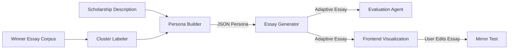

# PROJECT_OVERVIEW.md  
**Project Name:** Adaptive Scholarship Matching + AI Drafting  
**Owner:** Nguyen Duc Anh Vo (Bruce Vo)  
**Team:** Agentiiv Hackathon Team — AI Innovation Track  
**Repository Goal:** Develop a next-generation scholarship assistance platform that not only matches students to opportunities, but also helps them *apply intelligently* through adaptive, AI-guided essay generation and analysis.

---

## 🎯 1. Project Purpose

Most scholarship tools today only **match** students to opportunities — they don't help them understand *what each scholarship actually values*.  
This project aims to close that gap by building an **AI system that learns the hidden "personality" of scholarships** and generates **tailored application essays** aligned to those personalities.

It's designed for:
- Students who struggle to write differentiated essays for multiple scholarships.  
- Institutions that want transparent, explainable AI assistance for application support.  
- Educators or mentors seeking a tool to help students reflect their strengths more effectively.

---

## 🧠 2. Core Concept

> "Each scholarship has a personality — our system learns it."

### Problem Statement
- Students reuse the same generic essays.
- Scholarship criteria are written vaguely.
- Hidden priorities (like community service vs. merit) are not explicit.
- Students fail to emphasize the right traits.

### Solution
Use **LLM-driven pattern recognition** to:
1. Analyze scholarship descriptions and detect key traits (values, tone, emphasis).
2. Build a **Scholarship Personality Genome**.
3. Generate **personalized essays** that align a student's story with those values.
4. Provide **explainable feedback and visual insights** comparing adaptive vs generic essays.

---

## 🧩 3. Functional Overview

| Component | Description | Input | Output |
|-----------|-------------|-------|--------|
| **Persona Builder** | Extracts a scholarship's "personality genome" (weights + tone) from text | Scholarship description | JSON with trait weights and tone |
| **Essay Generator** | Drafts a personalized essay matching that persona | Persona + Student Profile | 3-paragraph JSON essay with focus tags |
| **Evaluation Agent** | Compares adaptive essay vs generic essay | Persona + 2 essays | Alignment gain + tone match + summary |
| **Mirror Test** | Reviews existing essay and suggests improvements | Persona + Essay | Paragraph-level feedback |
| **Cluster Labeler** | Learns archetypes from winner essays | Winner samples | Cluster name + style weights |

---

## ⚙️ 4. Technical Architecture

### Frontend
- **Stack:** React + TypeScript + Zustand + Vite  
- **Purpose:**  
  - Input scholarship data, student profile.  
  - Display generated essay with paragraph highlights.  
  - Render heatmaps and radar charts showing alignment.  
- **Key Components:**  
  - `EssayHeatmap`, `PersonaCard`, `ProfileForm`, `AlignmentRadar`.

### Backend
- **Stack:** Python (FastAPI)  
- **Purpose:**  
  - Host API endpoints for each LLM task.  
  - Manage request orchestration between Claude and the frontend.  
  - Run validation, scoring, clustering.  
- **Modules:**  
  - `/api/routes/` — endpoint definitions  
  - `/api/controllers/` — persona, essay, evaluation logic  
  - `/api/services/` — Claude API + vector clustering  
  - `/db/models/` — schema for cached personas, essays  

### Database
- **Type:** PostgreSQL 14+  
- **Usage:** Cache analysis results, store user essays, and track evaluations.  

### LLM Integration
- **Provider:** Anthropic Claude (via API)  
- **Prompt Set:** Defined under `.claude/prompts/`  
- **Behavior:**  
  - All prompts output structured JSON validated against `.claude/utils/schema_examples.md`.  
  - Each module in the backend maps to its corresponding prompt file.

---

## 🗂️ 5. Repository Structure Overview

```text
/
├── .claude/
│   ├── CLAUDE.md              # Master config for Claude Code
│   ├── system/                # Context, setup, and rules
│   ├── prompts/               # Task-specific prompt files
│   └── utils/                 # JSON schema + testcases
├── backend/
│   ├── api/routes/            # FastAPI endpoints
│   ├── api/controllers/       # Main business logic
│   ├── api/services/          # Claude integration + scoring
│   ├── db/                    # Migrations and models
│   └── main.py                # App entry
├── frontend/
│   ├── src/components/        # UI components
│   ├── src/hooks/             # React hooks
│   ├── src/stores/            # Zustand stores
│   ├── src/utils/             # Shared functions
│   ├── src/constants/         # Trait mappings, colors, etc.
│   └── main.tsx               # Entry point
├── data/
│   ├── scholarships.json      # Sample scholarships
│   ├── winner_essays/         # Corpus for clustering
│   └── clusters.json          # Output of cluster labeling
└── package.json / pyproject.toml / README.md
```

---

## 🔍 6. Data Flow Summary



### Explanation:
- Scholarship text → Persona → Essay → Evaluation → Visualization.
- Winner essays feed back into persona refinement via clusters.

---

## 💡 7. AI Design Principles

| Principle | Implementation |
|-----------|----------------|
| **Explainable AI** | Every output includes reasoning or tagging fields (e.g., `focus`, `reason`, `alignment_score`). |
| **Transparency** | All LLM outputs use strict JSON schemas, no free text. |
| **Adaptivity** | Trait weights dynamically adjust per scholarship description. |
| **Human Authenticity** | Essays are written in natural, human-like style without AI signatures. |
| **Scalability** | Each prompt module is independent; tasks can run in parallel or via queues. |

---

## 🧮 8. Technical Requirements & Dependencies

### Languages
- **Python** ≥ 3.11
- **Node.js** ≥ 18.x
- **TypeScript** ≥ 5.x

### Libraries

**Backend:**
- `fastapi`, `pydantic`, `httpx`, `sqlalchemy`, `pytest`

**Frontend:**
- `react`, `zustand`, `react-testing-library`, `recharts`, `vite`

**AI Integration:**
- Anthropic Claude API

### Environment Variables
```
DATABASE_URL=postgresql://...
CLAUDE_API_KEY=sk-...
FRONTEND_URL=http://localhost:5173
```

---

## 🧠 9. Core AI Prompts (Modules Overview)

| Module | Purpose | Input | Output |
|--------|---------|-------|--------|
| `persona_builder.md` | Extract scholarship values & tone | Scholarship text | Persona JSON |
| `essay_generator.md` | Create essay matching persona | Persona + profile | 3-paragraph JSON essay |
| `cluster_labeler.md` | Label clusters of winners | Essay samples | Archetype + weights |
| `evaluation_agent.md` | Compare adaptive vs generic | Persona + essays | Alignment delta |
| `mirror_test.md` | Critique existing essay | Persona + essay | Feedback + improvement summary |

---

## 📊 10. Example Scenario

### Input
- **Scholarship:** "Awarded to students who demonstrate leadership in promoting sustainable technology."
- **Student:** Engineering major who led a recycling robotics project.

### Process
1. **Persona Builder** → The Sustainable Leader (Leadership=0.45, Innovation=0.35, Community=0.20)
2. **Essay Generator** → Draft highlights environmental leadership and robotics innovation.
3. **Evaluation Agent** → Shows +0.22 improvement over generic essay.
4. **Mirror Test** → Suggests adding measurable sustainability impact.

### Output
Student receives essay + alignment visualization and explanation of why their story fits the scholarship best.

---

## 🚀 11. Future Improvements
- Multi-language essay support (EN, FR, VN).
- Integration with LinkedIn or academic CV for auto-profile generation.
- LLM fine-tuning for tone alignment across institutions.
- Essay "Heatmap Explainer" for per-sentence contribution scoring.
- Adaptive persona refinement from user feedback loops.

---

## 📈 12. Success Metrics

| Metric | Target |
|--------|--------|
| Essay alignment improvement | ≥ +0.20 vs generic baseline |
| JSON schema validation success | 100% across all prompts |
| Average essay coherence score | ≥ 0.85 (subjective QA) |
| Processing time per essay | < 4 seconds |
| Hackathon deliverables (video, repo, slides) | Complete & polished |

---

## 👥 13. Intended Deliverables

| Deliverable | Description |
|-------------|-------------|
| **Pitch Deck (PDF/PPTX)** | Explains problem, solution, and technical design. |
| **Demo Video (10–15 min)** | Walkthrough of app and essay generation flow. |
| **GitHub Repository** | Full source code with `.claude/` config and documentation. |
| **API Demo Endpoint** | Deployed FastAPI + Claude integration preview. |

---

## ✅ 14. Summary

This repository houses a full-stack AI application that merges education, writing assistance, and explainable AI — helping students not only find scholarships but also win them through personalized, data-driven storytelling.

Claude Code and human developers share the same context through the `.claude/` configuration layer, enabling structured, transparent collaboration between human logic and AI automation.

### Tagline:

> "We don't just help students apply.  
> We help them resonate."

---
